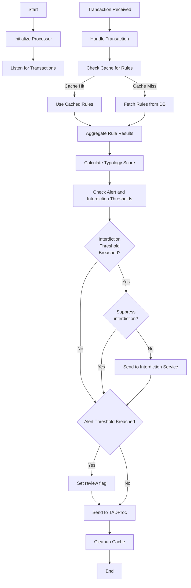

<!-- SPDX-License-Identifier: Apache-2.0 -->

# Typology Processor

## Overview
An overview of the processor is detailed [here](https://github.com/tazama-lf/docs/blob/main/Product/typology-processing.md)

- [Typology Processor](#typology-processor)
  - [Overview](#overview)
  - [Example Input](#example-input)
  - [Internal process flow](#internal-process-flow)
  - [Example Output](#example-output)
  - [Environment variables](#environment-variables)
        - [Additional Variables](#additional-variables)
  - [Deployment](#deployment)
  - [Usage](#usage)
    - [Sample Typology Configuration](#sample-typology-configuration)
  - [Troubleshooting](#troubleshooting)
      - [npm install](#npm-install)
      - [npm build](#npm-build)


## Example Input
<details>

<summary>JS input</summary>

```js
{
  transaction: {
    TxTp: "pacs.002.001.12",
    FIToFIPmtSts: {
      GrpHdr: {
        MsgId: "c35d3b33e6be4f848b0510d359c836e7",
        CreDtTm: "2025-06-12T10:51:49.696Z",
      },
      TxInfAndSts: {
        OrgnlInstrId: "7417ae743ed54f2a824e9868104ce2da",
        OrgnlEndToEndId: "1bd538f63e55449c8a74443e2ec4fe5e",
        TxSts: "ACCC",
        ChrgsInf: [
          {
            Amt: {
              Amt: 0,
              Ccy: "USD",
            },
            Agt: {
              FinInstnId: {
                ClrSysMmbId: {
                  MmbId: "fsp001",
                },
              },
            },
          },
          {
            Amt: {
              Amt: 0,
              Ccy: "USD",
            },
            Agt: {
              FinInstnId: {
                ClrSysMmbId: {
                  MmbId: "fsp001",
                },
              },
            },
          },
          {
            Amt: {
              Amt: 0,
              Ccy: "USD",
            },
            Agt: {
              FinInstnId: {
                ClrSysMmbId: {
                  MmbId: "fsp002",
                },
              },
            },
          },
        ],
        AccptncDtTm: "2023-06-02T07:52:31.000Z",
        InstgAgt: {
          FinInstnId: {
            ClrSysMmbId: {
              MmbId: "fsp001",
            },
          },
        },
        InstdAgt: {
          FinInstnId: {
            ClrSysMmbId: {
              MmbId: "fsp002",
            },
          },
        },
      },
    },
  },
  networkMap: {
    active: true,
    cfg: "1.0.0",
    messages: [
      {
        id: "004@1.0.0",
        cfg: "1.0.0",
        txTp: "pacs.002.001.12",
        typologies: [
          {
            id: "typology-processor@1.0.0",
            cfg: "999@1.0.0",
            rules: [
              {
                id: "EFRuP@1.0.0",
                cfg: "none",
              },
              {
                id: "901@1.0.0",
                cfg: "1.0.0",
              },
            ],
          },
        ],
      },
    ],
  },
  DataCache: {
    dbtrId: "dbtr_36f5098efdaa40dba752ffeee138b9d1MSISDN",
    cdtrId: "cdtr_7aace1b0888d49f287415a3a17cdf6b4TAZAMA_EID",
    cdtrAcctId: "cdtrAcct_c924e2f088ec45da896501700564c0cdTAZAMA_EIDfsp002",
    dbtrAcctId: "dbtrAcct_d04320a333b048fca8808b4e52415b03MSISDNfsp001",
    instdAmt: {
      amt: 536.34,
      ccy: "XTS",
    },
    intrBkSttlmAmt: {
      amt: 536.34,
      ccy: "XTS",
    },
    creDtTm: "2025-06-12T10:46:49.696Z",
  },
  metaData: {
    prcgTmDP: 4431338,
    prcgTmED: 330002,
  },
  ruleResult: {
    id: "EFRuP@1.0.0",
    cfg: "none",
    subRuleRef: "none",
    prcgTm: 1278111,
  },
}
```
</details>

## Internal process flow



## Example Output
<details>

<summary>JS output</summary>

```js
{
  typologyResult: {
    id: "typology-processor@1.0.0",
    cfg: "999@1.0.0",
    result: 100,
    ruleResults: [
      {
        id: "EFRuP@1.0.0",
        cfg: "none",
        subRuleRef: "none",
        prcgTm: 8145412,
        wght: "0",
      },
      {
        id: "901@1.0.0",
        cfg: "1.0.0",
        subRuleRef: ".01",
        prcgTm: 67631142,
        wght: "100",
      },
    ],
    workflow: {
      alertThreshold: 200,
      interdictionThreshold: 400,
      flowProcessor: "EFRuP@1.0.0",
    },
    review: true,
    prcgTm: 25819313473,
  },
  transaction: {
    TxTp: "pacs.002.001.12",
    FIToFIPmtSts: {
      GrpHdr: {
        MsgId: "cf60b5b7734a4cec88778937a5a0d501",
        CreDtTm: "2025-06-12T08:08:08.472Z",
      },
      TxInfAndSts: {
        OrgnlInstrId: "b85b0975def8426895b7950d4962e808",
        OrgnlEndToEndId: "4b76ad6885ee4c948ce731fc06d68d31",
        TxSts: "ACCC",
        ChrgsInf: [
          {
            Amt: {
              Amt: 0,
              Ccy: "USD",
            },
            Agt: {
              FinInstnId: {
                ClrSysMmbId: {
                  MmbId: "fsp001",
                },
              },
            },
          },
          {
            Amt: {
              Amt: 0,
              Ccy: "USD",
            },
            Agt: {
              FinInstnId: {
                ClrSysMmbId: {
                  MmbId: "fsp001",
                },
              },
            },
          },
          {
            Amt: {
              Amt: 0,
              Ccy: "USD",
            },
            Agt: {
              FinInstnId: {
                ClrSysMmbId: {
                  MmbId: "fsp002",
                },
              },
            },
          },
        ],
        AccptncDtTm: "2023-06-02T07:52:31.000Z",
        InstgAgt: {
          FinInstnId: {
            ClrSysMmbId: {
              MmbId: "fsp001",
            },
          },
        },
        InstdAgt: {
          FinInstnId: {
            ClrSysMmbId: {
              MmbId: "fsp002",
            },
          },
        },
      },
    },
  },
  networkMap: {
    active: true,
    cfg: "1.0.0",
    messages: [
      {
        id: "004@1.0.0",
        cfg: "1.0.0",
        txTp: "pacs.002.001.12",
        typologies: [
          {
            id: "typology-processor@1.0.0",
            cfg: "999@1.0.0",
            rules: [
              {
                id: "EFRuP@1.0.0",
                cfg: "none",
              },
              {
                id: "901@1.0.0",
                cfg: "1.0.0",
              },
            ],
          },
        ],
      },
    ],
  },
  DataCache: {
    dbtrId: "dbtr_8abc80a7b7bc4ec88fd02a9adc56d3eaMSISDN",
    cdtrId: "cdtr_0938580d34414a4eaf45c3f8f201b9deTAZAMA_EID",
    cdtrAcctId: "cdtrAcct_95e04bcc6e54492599b8b4dd03e3333fTAZAMA_EIDfsp002",
    dbtrAcctId: "dbtrAcct_d87971a0bcc74519ae20c45a8b4d9dc5MSISDNfsp001",
    instdAmt: {
      amt: 110.05,
      ccy: "XTS",
    },
    intrBkSttlmAmt: {
      amt: 110.05,
      ccy: "XTS",
    },
    creDtTm: "2025-06-12T08:03:08.472Z",
  },
  metaData: {
    prcgTmDP: 12644208,
    prcgTmED: 35151190,
  },
}
```
</details>

## Environment variables

You then need to configure your environment: a [sample](.env.template) configuration file has been provided and you may adapt that to your environment. Copy it to `.env` and modify as needed:

```sh
cp .env.template .env
```
A [registry](https://github.com/tazama-lf/docs/blob/f292c9ddabf52d6fe62addc1c61957419ed4ad05/Technical/processor-startup-config-registry.md) of environment variables is provided to provide more context for what each variable is used for.

##### Additional Variables

| Variable                           | Purpose                                                                                               | Example                    |
|------------------------------------|-------------------------------------------------------------------------------------------------------|----------------------------|
| `CONFIGURATION_DATABASE`           | PostgreSQL database name                                                                              | `configuration`            |
| `CONFIGURATION_DATABASE_HOST`      | PostgreSQL hostname or endpoint                                                                       | `localhost`                |
| `CONFIGURATION_DATABASE_PORT`      | PostgreSQL post used                                                                                  | `5432`                     |
| `CONFIGURATION_DATABASE_USER`      | PostgreSQL username                                                                                   | `root`                     |
| `CONFIGURATION_DATABASE_PASSWORD`  | PostgreSQL database password                                                                          | `password`                 |
| `CONFIGURATION_DATABASE_CERT_PATH` | PostgreSQL certificate path                                                                           | `/path/to/certificate.crt` |
| `SUPPRESS_ALERTS`                  | Suppress forwarding of Typology Result to the interdiction service                                    | `false`                    |
| `INTERDICTION_PRODUCER`            | The interdiction service NATS subject where typology interdiction threshold breaches will be reported | `interdiction-service`     |


## Deployment

## Usage

### Sample Typology Configuration

```json
{
  "desc": "Use of several currencies, structured transactions, with a great number of persons involved, large number of transactions related to each other during a short time period.",
  "id": "typology-processor@1.0.0",
  "cfg": "001@1.0.0",
  "workflow": {
    "alertThreshold": 800
  },
  "rules": [
    {
      "id": "003@1.0.0",
      "cfg": "1.0.0",
      "termId": "v003at100at100",
      "wghts": [
        {
          "ref": ".err",
          "wght": 0
        },
        {
          "ref": ".01",
          "wght": 0
        },
        {
          "ref": ".02",
          "wght": 400
        }
      ]
    },
    {
      "id": "EFRuP@1.0.0",
      "cfg": "none",
      "termId": "vEFRuPat100at100",
      "wghts": [
        {
          "ref": "block",
          "wght": 0
        },
        {
          "ref": "override",
          "wght": 0
        },
        {
          "ref": "none",
          "wght": 0
        }
      ]
    }
  ],
  "expression": [
    "Add", 
    "v003at100at100", 
    "v003at100at100"
  ]
}

```

## Troubleshooting
#### npm install
Ensure generated token has read package rights

#### npm build
Ensure that you're on the current LTS version of Node.JS