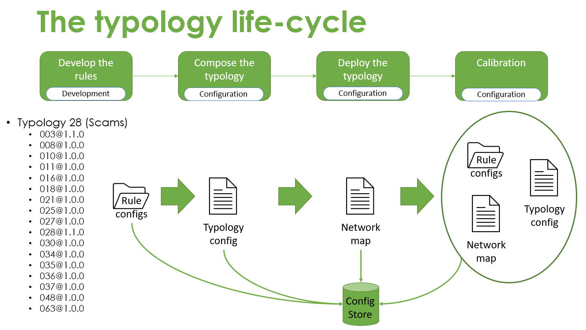
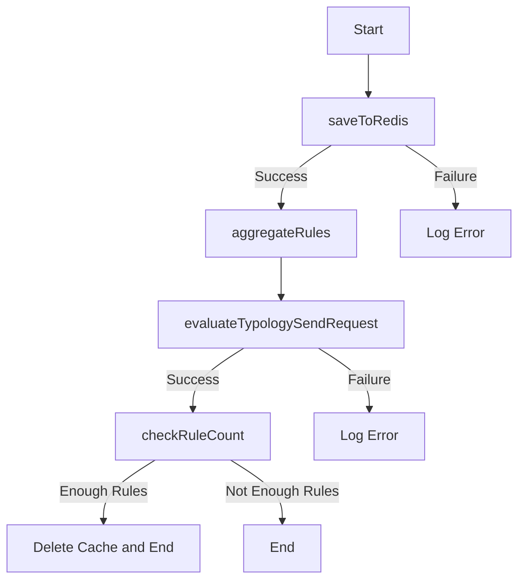

<!-- SPDX-License-Identifier: Apache-2.0 -->

# Typology Processor

## Overview
An overview of the processor is detailed [here](https://github.com/frmscoe/docs/blob/main/Product/typology-processing.md)

- [Inputs](#inputs)
- [Internal process flow](#internal-process-flow)
- [Outputs](#outputs)
- [Deployment](#deployment)
- [Usage](#usage)
    - [Sample Typology Expression](#sample-typology-expression)
    - [Sample NATS subscription payload](#sample-nats-subscription-payload)
    - [Sample response from TP:](#sample-response-from-tp)
- [Troubleshooting](#troubleshooting)



## Inputs

```js
{
  transaction: { 
    networkMap; // https://raw.githubusercontent.com/frmscoe/frms-coe-lib/aad0f12d07a82dd948fa9d8033f96e9bf8cb3dde/src/interfaces/NetworkMap.ts
    ruleResult; // https://raw.githubusercontent.com/frmscoe/frms-coe-lib/aad0f12d07a82dd948fa9d8033f96e9bf8cb3dde/src/interfaces/rule/RuleResult.ts
    transaction; // { TxTp: "pacs.002.001.12", "FIToFIPmtSts": { /* Pacs002 */ } }
    metaData: // { traceParent: "00-4bf92f3577b34da6a3ce928d0e0e4736-00f067aa0ba902b7-01" }
  }
};
```

## Internal process flow




## Outputs
```js
// TADP
{
  transaction: { 
    networkMap; // https://raw.githubusercontent.com/frmscoe/frms-coe-lib/aad0f12d07a82dd948fa9d8033f96e9bf8cb3dde/src/interfaces/NetworkMap.ts
    ruleResult; // https://raw.githubusercontent.com/frmscoe/frms-coe-lib/aad0f12d07a82dd948fa9d8033f96e9bf8cb3dde/src/interfaces/rule/RuleResult.ts
    transaction; // { TxTp: "pacs.002.001.12", "FIToFIPmtSts": { /* Pacs002 */ } }
    metaData: // { traceParent: "00-4bf92f3577b34da6a3ce928d0e0e4736-00f067aa0ba902b7-01" }
  }
};

// CMS on interdiction
{
  typologyResult: TypologyResult; // https://raw.githubusercontent.com/frmscoe/frms-coe-lib/46d1ec1fc9a07b6556baa4fecd80e09c709ccb1b/src/interfaces/processor-files/TypologyResult.ts
  transaction: Pacs002; // https://raw.githubusercontent.com/frmscoe/frms-coe-lib/cb464248be1efc45ba2701131e75fcf89c478baf/src/interfaces/Pacs.002.001.12.ts
  networkMap: NetworkMap; // https://raw.githubusercontent.com/frmscoe/frms-coe-lib/aad0f12d07a82dd948fa9d8033f96e9bf8cb3dde/src/interfaces/NetworkMap.ts
  metaData?: {
    prcgTmDp: number;
    prcgTmED: number;
}
```

## Environment variables

You then need to configure your environment: a [sample](.env.template) configuration file has been provided and you may adapt that to your environment. Copy it to `.env` and modify as needed:

```sh
cp .env.template .env
```
A [registry](https://github.com/frmscoe/docs) of environment variables is provided to provide more context for what each variable is used for.

##### Additional Variables

| Variable | Purpose | Example
| ------ | ------ | ------ |
| `DATABASE_NAME` | ArangoDB database for TP | `configuration`
| `DATABASE_URL` | ArangoDB server URL | `tcp://arango:8529`
| `DATABASE_USER` | ArangoDB username | `root`
| `DATABASE_PASSWORD` | ArangoDB password for username | `<secure_user_password>`
| `DATABASE_CERT_PATH` | Certificate's path used for TLS by Arango | `<path_to_certificate>`
| `SUPPRESS_ALERTS` | Suppress forwarding of Typology Result to CMS | `false`

## Deployment

## Usage

### Sample Typology Configuration

```json
{
  "desc": "Use of several currencies, structured transactions, with a great number of persons involved, large number of transactions related to each other during a short time period.",
  "id": "typology-processor@1.0.0",
  "cfg": "001@1.0.0",
  "workflow": {
    "alertThreshold": 800
  },
  "rules": [
    {
      "id": "003@1.0.0",
      "cfg": "1.0.0",
      "termId": "v003at100at100",
      "wghts": [
        {
          "ref": ".err",
          "wght": 0
        },
        {
          "ref": ".01",
          "wght": 0
        },
        {
          "ref": ".02",
          "wght": 400
        }
      ]
    },
    {
      "id": "EFRuP@1.0.0",
      "cfg": "none",
      "termId": "vEFRuPat100at100",
      "wghts": [
        {
          "ref": "block",
          "wght": 0
        },
        {
          "ref": "override",
          "wght": 0
        },
        {
          "ref": "none",
          "wght": 0
        }
      ]
    }
  ],
  "expression": [
    "Add", 
    "v003at100at100", 
    "v003at100at100"
  ]
}

```

### Sample NATS subscription payload

```json
{
    "transaction": {
        "TxTp": "pain.001.001.11",
        "CstmrCdtTrfInitn": {
            "GrpHdr": {
                "MsgId": "2669e349-500d-44ba-9e27-7767a16608a0",
                "CreDtTm": "2021-10-07T09:25:31.000Z",
                "NbOfTxs": 1,
                "InitgPty": {
                    "Nm": "Ivan Reese Russel-Klein",
                    "Id": {
                        "PrvtId": {
                            "DtAndPlcOfBirth": {
                                "BirthDt": "1967-11-23",
                                "CityOfBirth": "Unknown",
                                "CtryOfBirth": "ZZ"
                            },
                            "Othr": {
                                "Id": "+27783078685",
                                "SchmeNm": {
                                    "Prtry": "MSISDN"
                                }
                            }
                        }
                    },
                    "CtctDtls": {
                        "MobNb": "+27-783078685"
                    }
                }
            },
            "PmtInf": {
                "PmtInfId": "b51ec534-ee48-4575-b6a9-ead2955b8069",
                "PmtMtd": "TRA",
                "ReqdAdvcTp": {
                    "DbtAdvc": {
                        "Cd": "ADWD",
                        "Prtry": "Advice with transaction details"
                    }
                },
                "ReqdExctnDt": {
                    "Dt": "2021-10-07",
                    "DtTm": "2021-10-07T09:25:31.000Z"
                },
                "Dbtr": {
                    "Nm": "Ivan Reese Russel-Klein",
                    "Id": {
                        "PrvtId": {
                            "DtAndPlcOfBirth": {
                                "BirthDt": "1967-11-23",
                                "CityOfBirth": "Unknown",
                                "CtryOfBirth": "ZZ"
                            },
                            "Othr": {
                                "Id": "+27783078685",
                                "SchmeNm": {
                                    "Prtry": "MSISDN"
                                }
                            }
                        }
                    },
                    "CtctDtls": {
                        "MobNb": "+27-783078685"
                    }
                },
                "DbtrAcct": {
                    "Id": {
                        "Othr": {
                            "Id": "+27783078685",
                            "SchmeNm": {
                                "Prtry": "PASSPORT"
                            }
                        }
                    },
                    "Nm": "Ivan Russel-Klein"
                },
                "DbtrAgt": {
                    "FinInstnId": {
                        "ClrSysMmbId": {
                            "MmbId": "dfsp001"
                        }
                    }
                },
                "CdtTrfTxInf": {
                    "PmtId": {
                        "EndToEndId": "c51ec534-ee48-4575-b6a9-ead2955b8069"
                    },
                    "PmtTpInf": {
                        "CtgyPurp": {
                            "Prtry": "TRANSFER"
                        }
                    },
                    "Amt": {
                        "InstdAmt": {
                            "Amt": {
                                "Amt": "50431891779910900",
                                "Ccy": "USD"
                            }
                        },
                        "EqvtAmt": {
                            "Amt": {
                                "Amt": "50431891779910900",
                                "Ccy": "USD"
                            },
                            "CcyOfTrf": "USD"
                        }
                    },
                    "ChrgBr": "DEBT",
                    "CdtrAgt": {
                        "FinInstnId": {
                            "ClrSysMmbId": {
                                "MmbId": "dfsp002"
                            }
                        }
                    },
                    "Cdtr": {
                        "Nm": "April Sam Adamson",
                        "Id": {
                            "PrvtId": {
                                "DtAndPlcOfBirth": {
                                    "BirthDt": "1923-04-26",
                                    "CityOfBirth": "Unknown",
                                    "CtryOfBirth": "ZZ"
                                },
                                "Othr": {
                                    "Id": "+27782722305",
                                    "SchmeNm": {
                                        "Prtry": "MSISDN"
                                    }
                                }
                            }
                        },
                        "CtctDtls": {
                            "MobNb": "+27-782722305"
                        }
                    },
                    "CdtrAcct": {
                        "Id": {
                            "Othr": {
                                "Id": "+27783078685",
                                "SchmeNm": {
                                    "Prtry": "MSISDN"
                                }
                            }
                        },
                        "Nm": "April Adamson"
                    },
                    "Purp": {
                        "Cd": "MP2P"
                    },
                    "RgltryRptg": {
                        "Dtls": {
                            "Tp": "BALANCE OF PAYMENTS",
                            "Cd": "100"
                        }
                    },
                    "RmtInf": {
                        "Ustrd": "Payment of USD 49932566118723700.89 from Ivan to April"
                    },
                    "SplmtryData": {
                        "Envlp": {
                            "Doc": {
                                "Cdtr": {
                                    "FrstNm": "Ivan",
                                    "MddlNm": "Reese",
                                    "LastNm": "Russel-Klein",
                                    "MrchntClssfctnCd": "BLANK"
                                },
                                "Dbtr": {
                                    "FrstNm": "April",
                                    "MddlNm": "Sam",
                                    "LastNm": "Adamson",
                                    "MrchntClssfctnCd": "BLANK"
                                },
                                "DbtrFinSvcsPrvdrFees": {
                                    "Ccy": "USD",
                                    "Amt": "499325661187237"
                                },
                                "Xprtn": "2021-10-07T09:30:31.000Z"
                            }
                        }
                    }
                }
            },
            "SplmtryData": {
                "Envlp": {
                    "Doc": {
                        "InitgPty": {
                            "InitrTp": "CONSUMER",
                            "Glctn": {
                                "Lat": "-3.1291",
                                "Long": "39.0006"
                            }
                        }
                    }
                }
            }
        }
    },
    "ruleResult": {
        "rule": "003@1.0.0",
        "result": true,
        "subRuleRef": "123"
        "prcgTm": 123456,
        "wght": 0
    },
    "networkMap": {
        "active": true,
        "cfg": "1.0.0",
        "messages": [
            {
                "id": "004@1.0.0",
                "host": "NATS Server",
                "cfg": "1.0.0",
                "txTp": "pacs.002.001.12",
                "typologies": [
                    {
                        "id": "typology-processor@1.0.0",
                        "host": "NATS Server",
                        "cfg": "001@1.0.0",
                        "rules": [
                            {
                                "id": "003@1.0.0",
                                "host": "RuleRequest003",
                                "cfg": "1.0.0"
                            }
                        ]
                    }
                ]
            }
        ]
    }
}
```

## Troubleshooting
#### npm install
Ensure generated token has read package rights

#### npm build
Ensure that you're on the current LTS version of Node.JS
