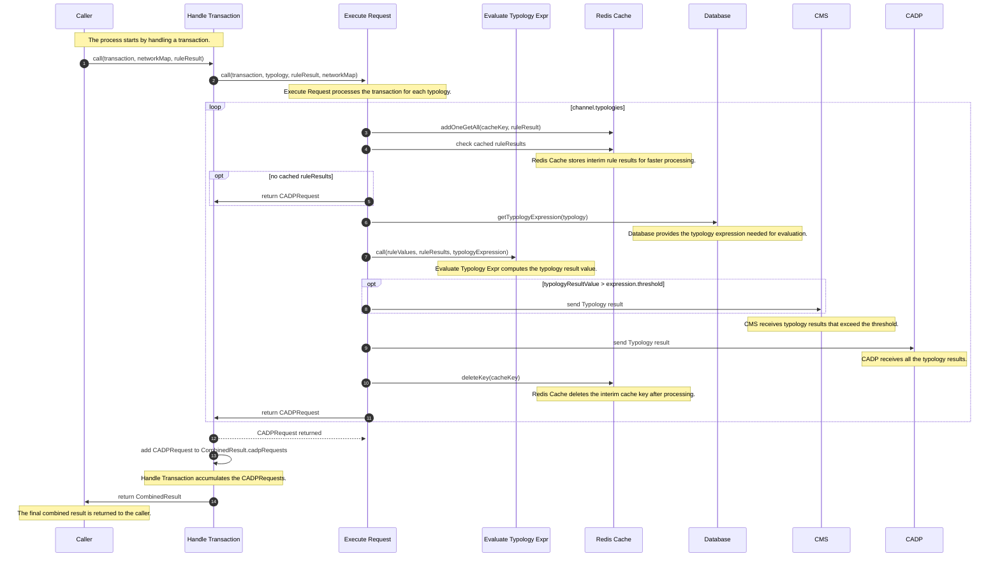

# Typology Processor

## Overview

Here's a brief explanation of each participant:

- Caller: The caller initiates the request to process a transaction.
- Handle Transaction: This function handles the transaction, coordinates the processing steps, and accumulates the results.
- Execute Request: This function processes the transaction for each typology and sends the results to CMS and CADP.
- Evaluate Typology Expr: This function computes the typology result value based on the provided expression.
- Redis Cache: Redis Cache stores interim rule results for faster processing and manages cache keys.
- Database: The Database provides the typology expression needed for evaluation.
- CMS: The CMS receives typology results that exceed the threshold.
- CADP: The CADP receives all the typology results.

## Sequence Diagram

Here's a detailed explanation of the numbers in the sequence diagram:

1. The process starts by handling a transaction. The caller initiates the request to process a transaction by calling the HandleTransaction function with the transaction, network map, and rule result as input parameters.
2. The HandleTransaction function, in turn, calls the ExecuteRequest function for each typology in the transaction. It passes the transaction, typology, rule result, and network map as input parameters.
3. The ExecuteRequest function processes the transaction for each typology. It interacts with Redis Cache to store and retrieve interim rule results for faster processing.
4. If there are no cached rule results, the ExecuteRequest function returns a CADPRequest to the HandleTransaction function.
5. The ExecuteRequest function retrieves the typology expression from the database.
6. The ExecuteRequest function calls the EvaluateTypologyExpr function to compute the typology result value based on the provided expression, rule values, and rule results.
7. If the computed typology result value is greater than the threshold, the ExecuteRequest function sends the typology result to the CMS.
8. The ExecuteRequest function sends all the typology results to the CADP.
9. After processing, the ExecuteRequest function deletes the interim cache key from Redis Cache.
10. The ExecuteRequest function returns a CADPRequest to the HandleTransaction function.
11. The HandleTransaction function accumulates the CADPRequests in a combined result.
12. Finally, the HandleTransaction function returns the combined result to the caller.
